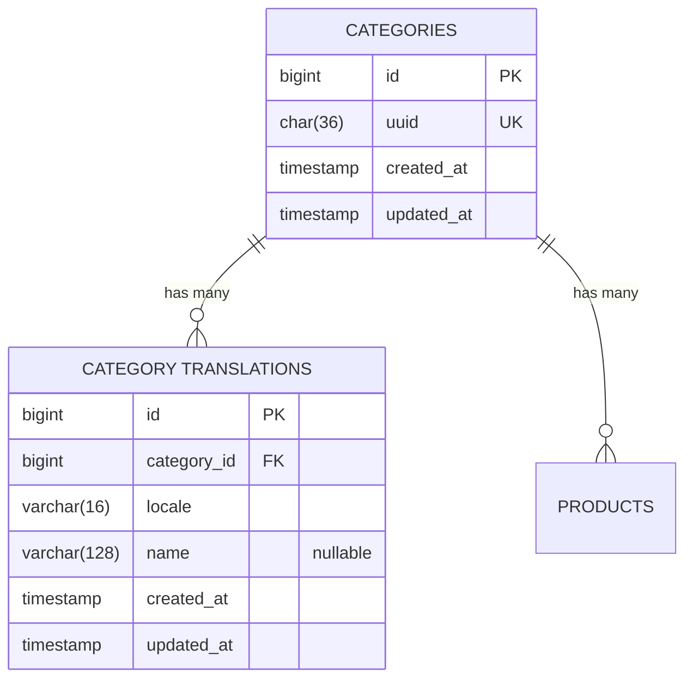

# Categories

```mermaid
erDiagram

CATEGORIES ||--o{ "CATEGORY TRANSLATIONS" : "has many"
CATEGORIES ||--o{ PRODUCTS : "has many"

    CATEGORIES {
        bigint id PK
        char(36) uuid UK
        timestamp created_at
        timestamp updated_at
    }

    "CATEGORY TRANSLATIONS" {
        bigint id PK
        bigint category_id FK
        varchar(16) locale
        varchar(128) name "nullable"
        timestamp created_at
        timestamp updated_at
    }

    PRODUCTS

```

### Unique constraints:

- CATEGORY TRANSLATIONS: (category_id, locale)
- CATEGORY TRANSLATIONS: (locale, name)

---

- [Return to documentation](../index.md)
