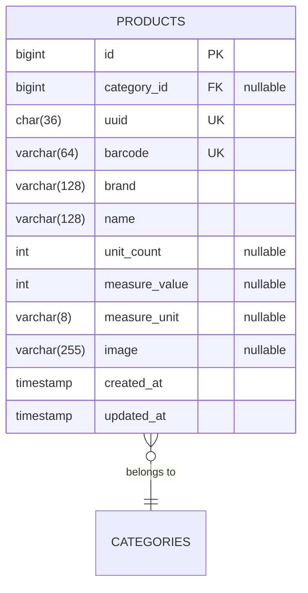

# Products

```mermaid
erDiagram

PRODUCTS }o--|| CATEGORIES : "belongs to"

    PRODUCTS {
        bigint id PK
        bigint category_id FK "nullable"
        char(36) uuid UK
        varchar(64) barcode UK
        varchar(128) brand
        varchar(128) name
        int unit_count "nullable"
        int measure_value "nullable"
        varchar(8) measure_unit "nullable"
        varchar(255) image "nullable"
        timestamp created_at
        timestamp updated_at
    }

    CATEGORIES
```

---

- [Return to documentation](../index.md)
