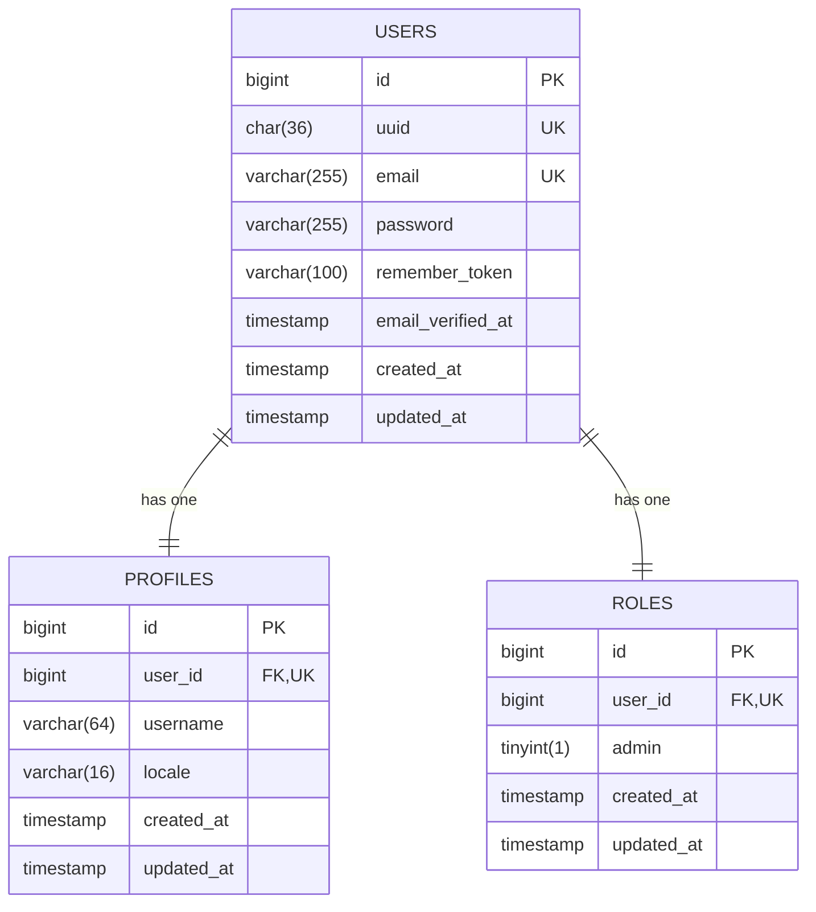

# Users

```mermaid
erDiagram

    USERS ||--|| PROFILES : "has one"
    USERS ||--|| ROLES : "has one"

    USERS {
        bigint id PK
        char(36) uuid UK
        varchar(255) email UK
        varchar(255) password
        varchar(100) remember_token
        timestamp email_verified_at
        timestamp created_at
        timestamp updated_at
    }

    PROFILES {
        bigint id PK
        bigint user_id FK, UK
        varchar(64) username
        varchar(16) locale
        timestamp created_at
        timestamp updated_at
    }

    ROLES {
        bigint id PK
        bigint user_id FK, UK
        tinyint(1) admin
        timestamp created_at
        timestamp updated_at
    }
```

---

- [Return to documentation](../index.md)
