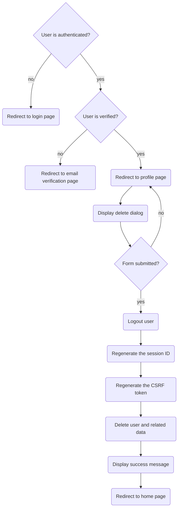

# Profile delete Flowchart

```mermaid
flowchart TB

uia --> | no | rtlp
uia --> | yes | uiv
uiv --> | no | rtevp
uiv --> | yes | rtpp
rtpp --> ddd --> fs
fs --> | no | rtpp
fs --> | yes | lu
lu --> rtsi --> rtct --> duard --> dsm --> rthp

uia@{ shape: diamond, label: "User is authenticated?" }
uiv@{ shape: diamond, label: "User is verified?" }
fs@{ shape: diamond, label: "Form submitted?" }

rtlp@{ shape: rounded, label: "Redirect to login page" }
rtevp@{ shape: rounded, label: "Redirect to email verification page" }
rtpp@{ shape: rounded, label: "Redirect to profile page" }
ddd@{ shape: rounded, label: "Display delete dialog" }
lu@{ shape: rounded, label: "Logout user" }
rtsi@{ shape: rounded, label: "Regenerate the session ID" }
rtct@{ shape: rounded, label: "Regenerate the CSRF token" }
duard@{ shape: rounded, label: "Delete user and related data" }
dsm@{ shape: rounded, label: "Display success message" }
rthp@{ shape: rounded, label: "Redirect to home page" }
```
