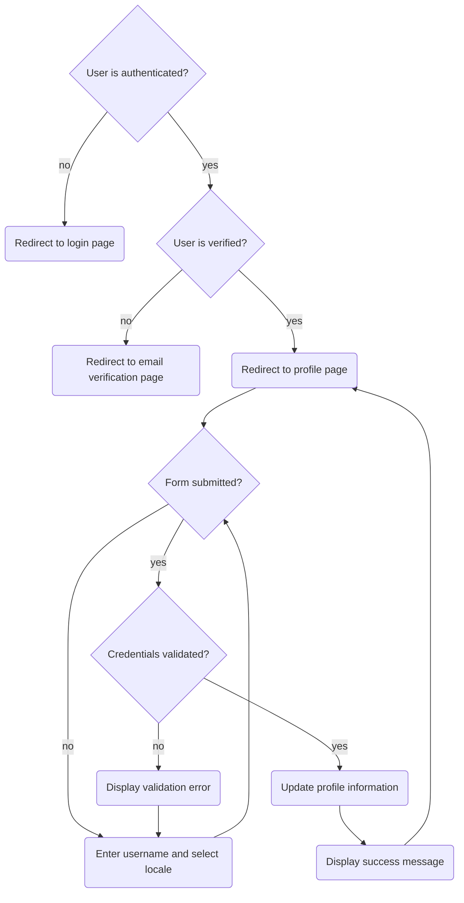

# Profile information Flowchart

```mermaid
flowchart TB

uia --> | no | rtlp
uia --> | yes | uiv
uiv --> | no | rtevp
uiv --> | yes | rtpp
rtpp --> fs
fs --> | no | euasl
euasl --> fs
fs --> | yes | cv
cv --> | no | dve
dve --> euasl
cv --> | yes | upi
upi --> dsm --> rtpp


uia@{ shape: diamond, label: "User is authenticated?" }
uiv@{ shape: diamond, label: "User is verified?" }
fs@{ shape: diamond, label: "Form submitted?" }
cv@{ shape: diamond, label: "Credentials validated?" }

rtlp@{ shape: rounded, label: "Redirect to login page" }
rtevp@{ shape: rounded, label: "Redirect to email verification page" }
rtpp@{ shape: rounded, label: "Redirect to profile page" }
euasl@{ shape: rounded, label: "Enter username and select locale" }
dve@{ shape: rounded, label: "Display validation error" }
upi@{ shape: rounded, label: "Update profile information" }
dsm@{ shape: rounded, label: "Display success message" }
```
