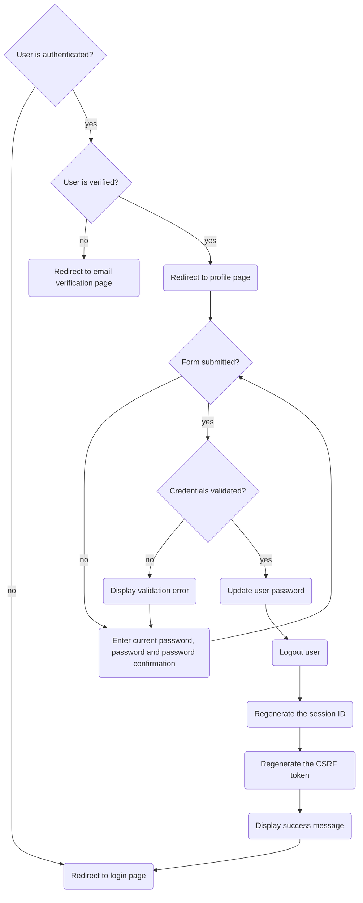

# Profile security Flowchart

```mermaid
flowchart TB

uia --> | no | rtlp
uia --> | yes | uiv
uiv --> | no | rtevp
uiv --> | yes | rtpp
rtpp --> fs
fs --> | no | ecppapc
ecppapc --> fs
fs --> | yes | cv
cv --> | no | dve
dve --> ecppapc
cv --> | yes | uup
uup --> lu --> rtsi --> rtct --> dsm --> rtlp

uia@{ shape: diamond, label: "User is authenticated?" }
uiv@{ shape: diamond, label: "User is verified?" }
fs@{ shape: diamond, label: "Form submitted?" }
cv@{ shape: diamond, label: "Credentials validated?" }

rtlp@{ shape: rounded, label: "Redirect to login page" }
rtevp@{ shape: rounded, label: "Redirect to email verification page" }
rtpp@{ shape: rounded, label: "Redirect to profile page" }
lu@{ shape: rounded, label: "Logout user" }
rtsi@{ shape: rounded, label: "Regenerate the session ID" }
rtct@{ shape: rounded, label: "Regenerate the CSRF token" }
ecppapc@{ shape: rounded, label: "Enter current password, password and password confirmation" }
dve@{ shape: rounded, label: "Display validation error" }
uup@{ shape: rounded, label: "Update user password" }
dsm@{ shape: rounded, label: "Display success message" }
```
