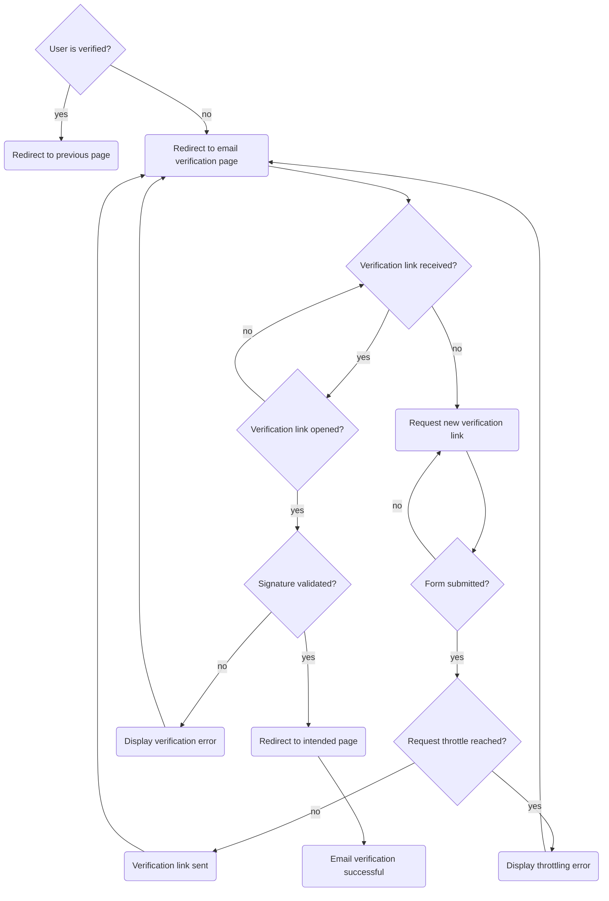

# Email verification Flowchart

```mermaid
flowchart TB

uiv --> | yes | rtpp
uiv --> | no | rtevp
rtevp --> vlr
vlr --> | no | rnvl
rnvl --> fs
fs --> | no | rnvl
fs --> | yes | rtr
rtr --> | no | vls
vls --> rtevp
rtr --> | yes | dte
dte --> rtevp
vlr --> | yes | vlo
vlo --> | no | vlr
vlo --> | yes | sv
sv --> | no | dve
dve --> rtevp
sv --> | yes | rtip
rtip --> evs

uiv@{ shape: diamond, label: "User is verified?" }
vlr@{ shape: diamond, label: "Verification link received?" }
fs@{ shape: diamond, label: "Form submitted?" }
rtr@{ shape: diamond, label: "Request throttle reached?" }
vlo@{ shape: diamond, label: "Verification link opened?" }
sv@{ shape: diamond, label: "Signature validated?" }

rtpp@{ shape: rounded, label: "Redirect to previous page" }
rtevp@{ shape: rounded, label: "Redirect to email verification page" }
rnvl@{ shape: rounded, label: "Request new verification link" }
vls@{ shape: rounded, label: "Verification link sent" }
dte@{ shape: rounded, label: "Display throttling error" }
dve@{ shape: rounded, label: "Display verification error" }
rtip@{ shape: rounded, label: "Redirect to intended page" }
evs@{ shape: rounded, label: "Email verification successful" }
```
