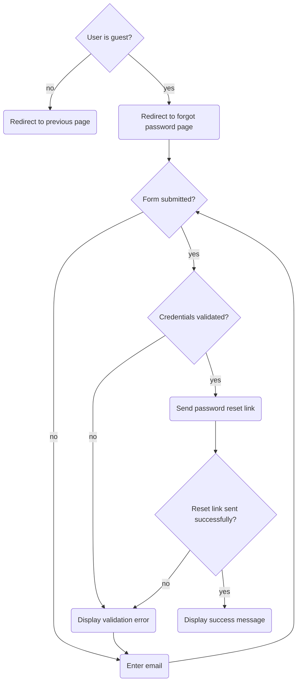

# Forgot password Flowchart

```mermaid
flowchart TB

uig --> | no | rtpp
uig --> | yes | rtfpp
rtfpp --> fs
fs --> | no | ee
ee --> fs
fs --> | yes | cv
cv --> | no | dve
dve --> ee
cv --> | yes | sprl
sprl --> rlss
rlss --> | no | dve
rlss --> | yes | dsm

uig@{ shape: diamond, label: "User is guest?" }
fs@{ shape: diamond, label: "Form submitted?" }
cv@{ shape: diamond, label: "Credentials validated?" }
rlss@{ shape: diamond, label: "Reset link sent successfully?" }

rtpp@{ shape: rounded, label: "Redirect to previous page" }
rtfpp@{ shape: rounded, label: "Redirect to forgot password page" }
ee@{ shape: rounded, label: "Enter email" }
dve@{ shape: rounded, label: "Display validation error" }
sprl@{ shape: rounded, label: "Send password reset link" }
dsm@{ shape: rounded, label: "Display success message" }
```
