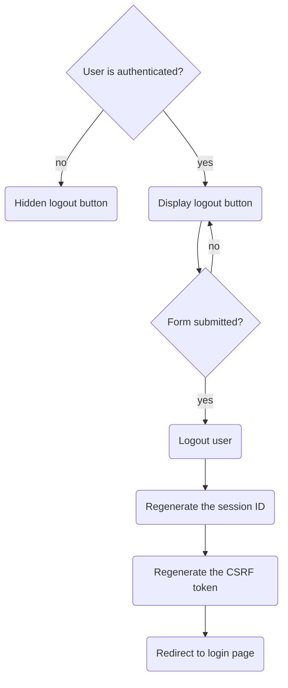

# Logout Flowchart

```mermaid
flowchart TB

uia --> | no | hlb
uia --> | yes | dlb
dlb --> fs
fs --> | no | dlb
fs --> | yes | lu
lu --> rtsi --> rtct --> rtlp

uia@{ shape: diamond, label: "User is authenticated?" }
fs@{ shape: diamond, label: "Form submitted?" }

hlb@{ shape: rounded, label: "Hidden logout button" }
dlb@{ shape: rounded, label: "Display logout button" }
lu@{ shape: rounded, label: "Logout user" }
rtsi@{ shape: rounded, label: "Regenerate the session ID" }
rtct@{ shape: rounded, label: "Regenerate the CSRF token" }
rtlp@{ shape: rounded, label: "Redirect to login page" }
```
