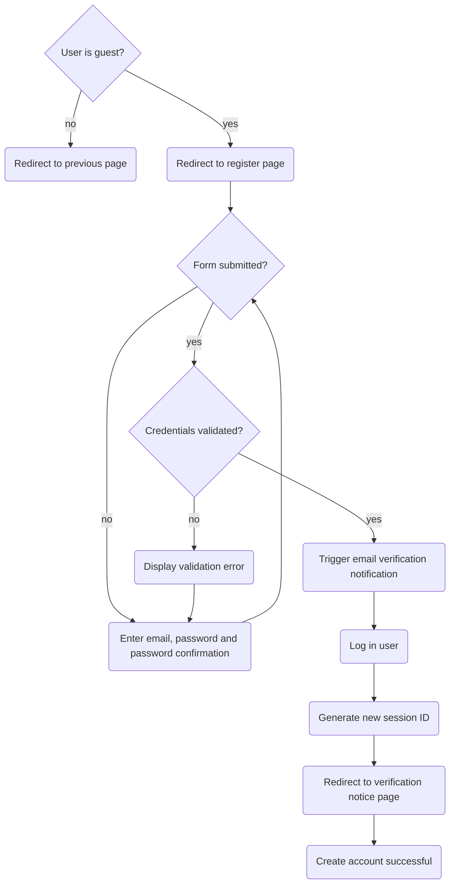

# Register Flowchart

```mermaid
flowchart TB

uig --> | no | rtpp
uig --> | yes | rtrp
rtrp --> fs
fs --> | no | eepapc
eepapc --> fs
fs --> | yes | cv
cv --> | no | dve
dve --> eepapc
cv --> | yes | tevn
tevn --> liu --> gnsi --> rtvnp -->cas

uig@{ shape: diamond, label: "User is guest?" }
fs@{ shape: diamond, label: "Form submitted?" }
cv@{ shape: diamond, label: "Credentials validated?" }

rtpp@{ shape: rounded, label: "Redirect to previous page" }
rtrp@{ shape: rounded, label: "Redirect to register page" }
eepapc@{ shape: rounded, label: "Enter email, password and password confirmation" }
dve@{ shape: rounded, label: "Display validation error" }
tevn@{ shape: rounded, label: "Trigger email verification notification" }
liu@{ shape: rounded, label: "Log in user" }
gnsi@{ shape: rounded, label: "Generate new session ID" }
rtvnp@{ shape: rounded, label: "Redirect to verification notice page" }
cas@{ shape: rounded, label: "Create account successful" }
```
