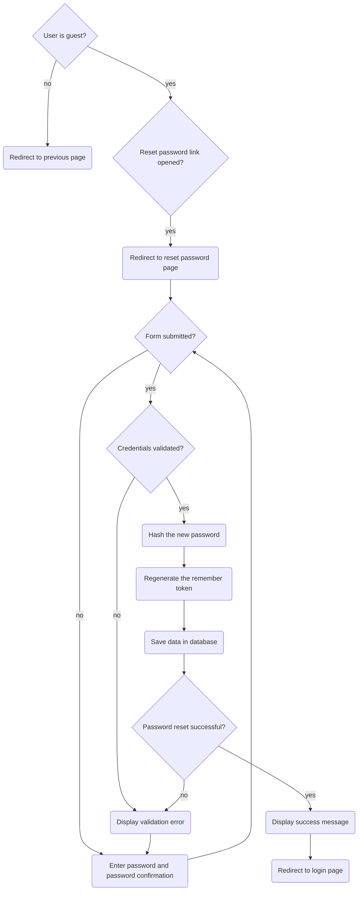

# Reset password Flowchart

```mermaid
flowchart TB

uig --> | no | rtpp
uig --> | yes | rplo
rplo --> | yes | rtrpp
rtrpp --> fs
fs --> | no | epapc
epapc --> fs
fs --> | yes | cv
cv --> | no | dve
dve --> epapc
cv --> | yes | htnp
htnp --> rtrt --> sdid --> prs
prs --> | no | dve
prs --> | yes | dsm
dsm --> rtlp

uig@{ shape: diamond, label: "User is guest?" }
rplo@{ shape: diamond, label: "Reset password link opened?" }
fs@{ shape: diamond, label: "Form submitted?" }
cv@{ shape: diamond, label: "Credentials validated?" }
prs@{ shape: diamond, label: "Password reset successful?" }

rtpp@{ shape: rounded, label: "Redirect to previous page" }
rtrpp@{ shape: rounded, label: "Redirect to reset password page" }
epapc@{ shape: rounded, label: "Enter password and password confirmation" }
dve@{ shape: rounded, label: "Display validation error" }
htnp@{ shape: rounded, label: "Hash the new password" }
rtrt@{ shape: rounded, label: "Regenerate the remember token" }
sdid@{ shape: rounded, label: "Save data in database" }
dsm@{ shape: rounded, label: "Display success message" }
rtlp@{ shape: rounded, label: "Redirect to login page" }
```
