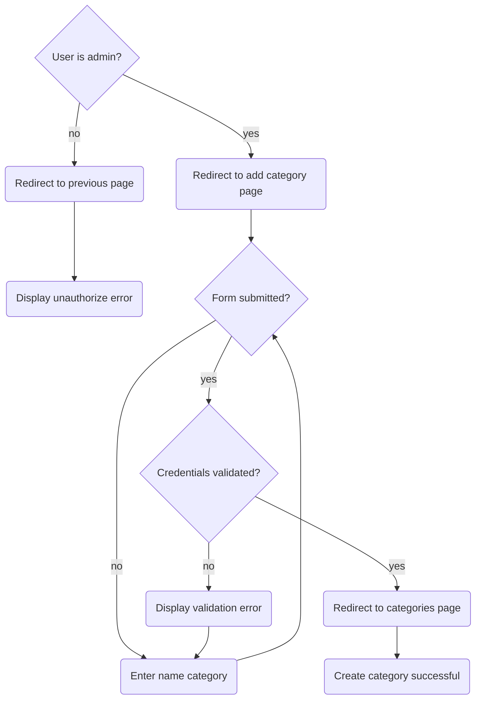

# Category create Flowchart

```mermaid
flowchart TB

uia --> | no | rtpp --> due
uia --> | yes | rtacp --> fs
fs --> | no | enc --> fs
fs --> | yes | cv
cv --> | no | dve --> enc
cv --> | yes | rtcp --> ccs

uia@{ shape: diamond, label: "User is admin?" }
fs@{ shape: diamond, label: "Form submitted?" }
cv@{ shape: diamond, label: "Credentials validated?" }

rtpp@{ shape: rounded, label: "Redirect to previous page" }
rtacp@{ shape: rounded, label: "Redirect to add category page" }
rtcp@{ shape: rounded, label: "Redirect to categories page" }
enc@{ shape: rounded, label: "Enter name category" }
due@{ shape: rounded, label: "Display unauthorize error" }
dve@{ shape: rounded, label: "Display validation error" }
ccs@{ shape: rounded, label: "Create category successful" }
```

---

- [Return to documentation](../index.md)
