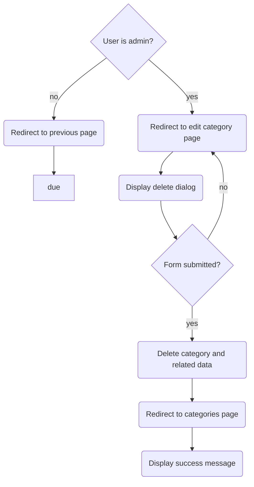

# Category delete Flowchart

```mermaid
flowchart TB

uia --> | no | rtpp --> due
uia --> | yes | rtecp --> ddd --> fs
fs --> | no | rtecp
fs --> | yes | dcard --> rtcp --> dsm

uia@{ shape: diamond, label: "User is admin?" }
fs@{ shape: diamond, label: "Form submitted?" }

rtpp@{ shape: rounded, label: "Redirect to previous page" }
rtecp@{ shape: rounded, label: "Redirect to edit category page" }
rtcp@{ shape: rounded, label: "Redirect to categories page" }

ddd@{ shape: rounded, label: "Display delete dialog" }
dcard@{ shape: rounded, label: "Delete category and related data" }
dsm@{ shape: rounded, label: "Display success message" }
```

---

- [Return to documentation](../index.md)
