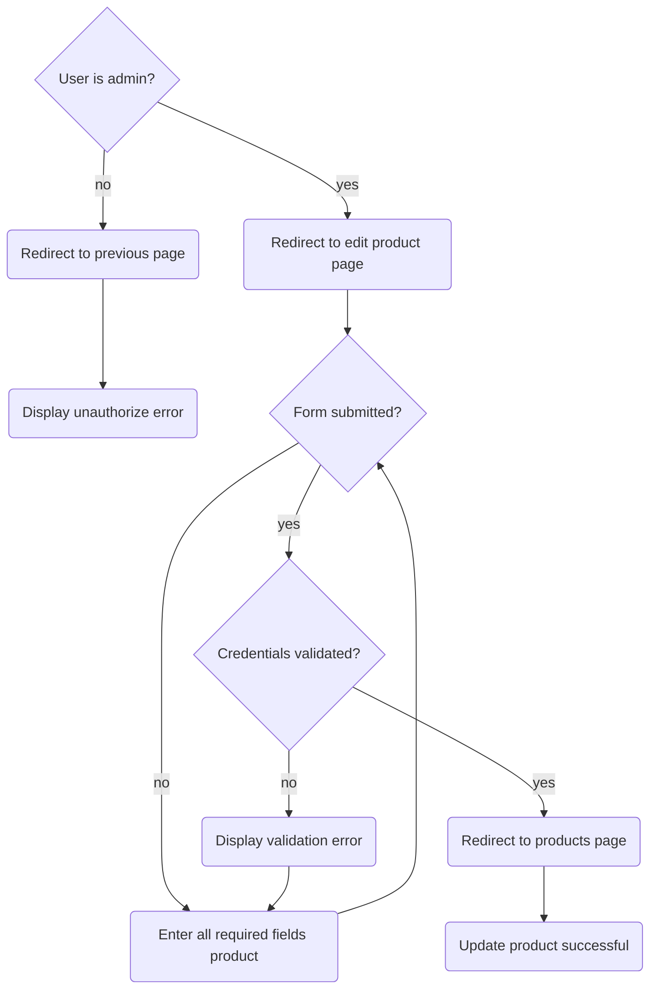

# Product update Flowchart

```mermaid
flowchart TB

uia --> | no | rtpp --> due
uia --> | yes | rtepp --> fs
fs --> | no | earfp --> fs
fs --> | yes | cv
cv --> | no | dve --> earfp
cv --> | yes | rtpp2 --> ups

uia@{ shape: diamond, label: "User is admin?" }
fs@{ shape: diamond, label: "Form submitted?" }
cv@{ shape: diamond, label: "Credentials validated?" }

rtpp@{ shape: rounded, label: "Redirect to previous page" }
rtepp@{ shape: rounded, label: "Redirect to edit product page" }
rtpp2@{ shape: rounded, label: "Redirect to products page" }
earfp@{ shape: rounded, label: "Enter all required fields product" }
due@{ shape: rounded, label: "Display unauthorize error" }
dve@{ shape: rounded, label: "Display validation error" }
ups@{ shape: rounded, label: "Update product successful" }
```

---

- [Return to documentation](../index.md)
