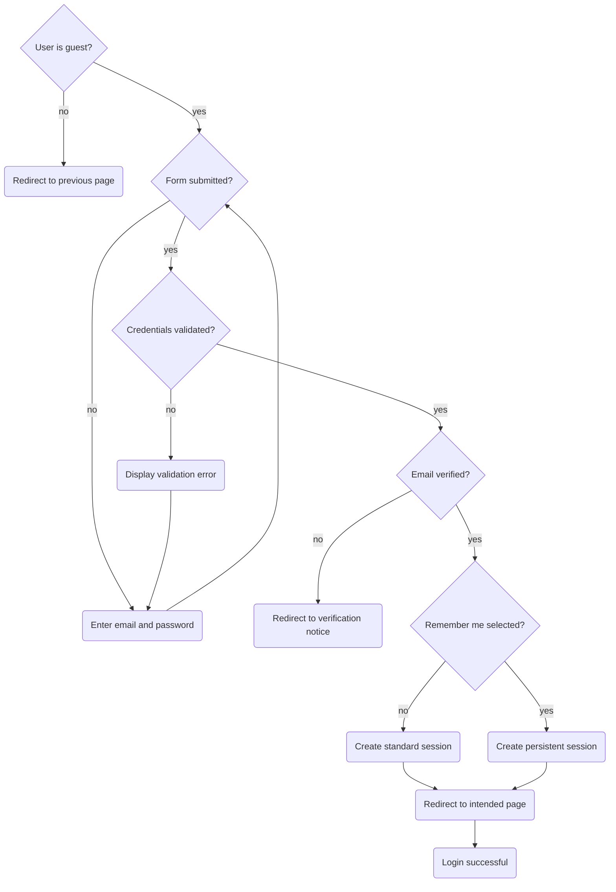

# Login Flowchart

```mermaid
flowchart TB

uig --> | no | rtpp
uig --> | yes | fs
fs --> | no | eeap
eeap --> fs
fs --> | yes | cv
cv --> | no | dve
dve --> eeap
cv --> | yes | ev
ev --> | no | rtvn
ev --> | yes | rms
rms --> | no | css --> rtip
rms --> | yes | cps --> rtip
rtip --> ls

uig@{ shape: diamond, label: "User is guest?" }
fs@{ shape: diamond, label: "Form submitted?" }
cv@{ shape: diamond, label: "Credentials validated?" }
ev@{ shape: diamond, label: "Email verified?" }
rms@{ shape: diamond, label: "Remember me selected?" }

rtpp@{ shape: rounded, label: "Redirect to previous page" }
eeap@{ shape: rounded, label: "Enter email and password" }
dve@{ shape: rounded, label: "Display validation error" }
rtvn@{ shape: rounded, label: "Redirect to verification notice" }
css@{ shape: rounded, label: "Create standard session" }
cps@{ shape: rounded, label: "Create persistent session" }
rtip@{ shape: rounded, label: "Redirect to intended page" }
ls@{ shape: rounded, label: "Login successful" }
```
